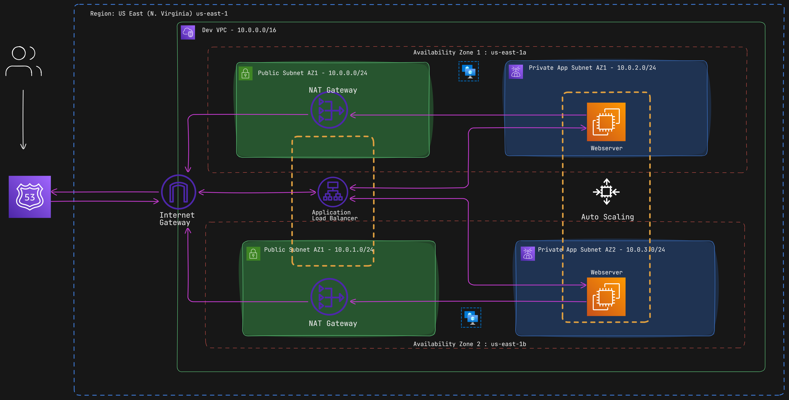

---
# Hosting a Static Website on AWS with High Availability and Scalability

This project demonstrates how to host a static HTML website on AWS, leveraging AWS services and best practices to ensure high availability, fault tolerance, and scalability. The infrastructure was designed with a focus on security, automation, and elasticity.

## Architecture Overview

The architecture consists of a Virtual Private Cloud (VPC) with both public and private subnets across two Availability Zones (AZs) for high availability and fault tolerance. Below are the main components and their roles:

1. **VPC**: 
   - Includes public and private subnets in two AZs.
   - Provides isolation and security for the resources.

2. **Internet Gateway**: 
   - Enables communication between instances in the VPC and the internet.

3. **Security Groups**:
   - Act as a firewall to control traffic to and from the instances.

4. **Public Subnets**:
   - Host the NAT Gateway, Bastion Host, and Application Load Balancer.

5. **Private Subnets**:
   - Securely host web servers and database servers.

6. **NAT Gateway**:
   - Allows instances in private subnets to access the internet without exposing them.

7. **Bastion Host**:
   - Provides secure SSH access to resources in the private subnet.

8. **EC2 Instances**:
   - Host the static website.
   - Deployed using an Auto Scaling Group to ensure scalability and elasticity.

9. **Application Load Balancer**:
   - Distributes traffic across multiple EC2 instances in multiple AZs for high availability.

10. **Auto Scaling Group**:
    - Dynamically adjusts the number of EC2 instances to handle traffic loads.

11. **Route 53**:
    - Used to register the domain and create DNS records.

12. **GitHub**:
    - Stores the website files and deployment scripts.

13. **Amazon Machine Image (AMI)**:
    - An AMI was created from the configured EC2 instance to enable quick scaling of instances.

## Features

- **High Availability**: Resources are distributed across multiple AZs.
- **Scalability**: Auto Scaling Group dynamically manages EC2 instances.
- **Security**: Web and database servers are placed in private subnets, protected by Security Groups.
- **Fault Tolerance**: Redundant resources ensure minimal downtime.
- **Elasticity**: Resources adjust automatically based on traffic.

## Deployment Steps

1. **Steps to enable httpd and copy website files**:
   ```bash
   #!/bin/bash

   sudo su
   yum update -y
   yum install -y httpd
   cd /var/www/html
   cd /var/www/html
   wget https://github.com/azeezsalu/mole-site1/raw/main/mole.zip
   upzip mole.zip
   cp -r /var/www/html/mole.main/* /var/www/html
   rm -rf mole.zip mole-main
   systemctl enable httpd
   systemctl start httpd
